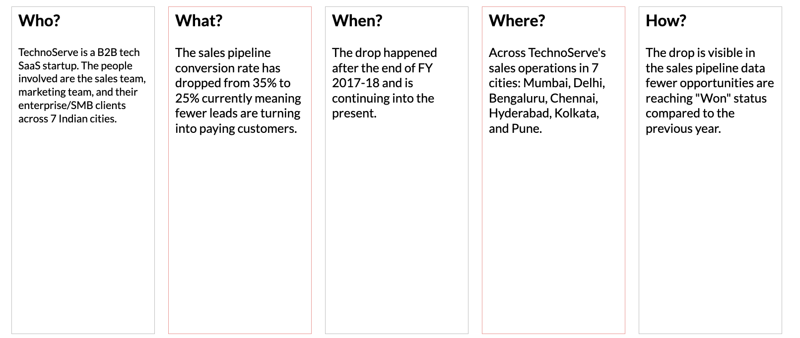
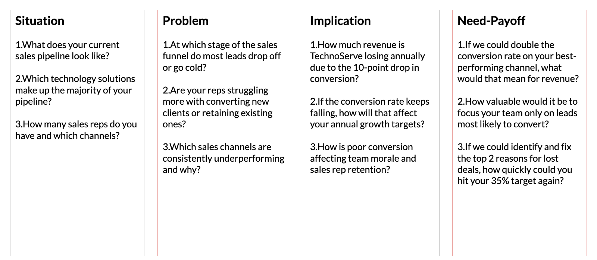
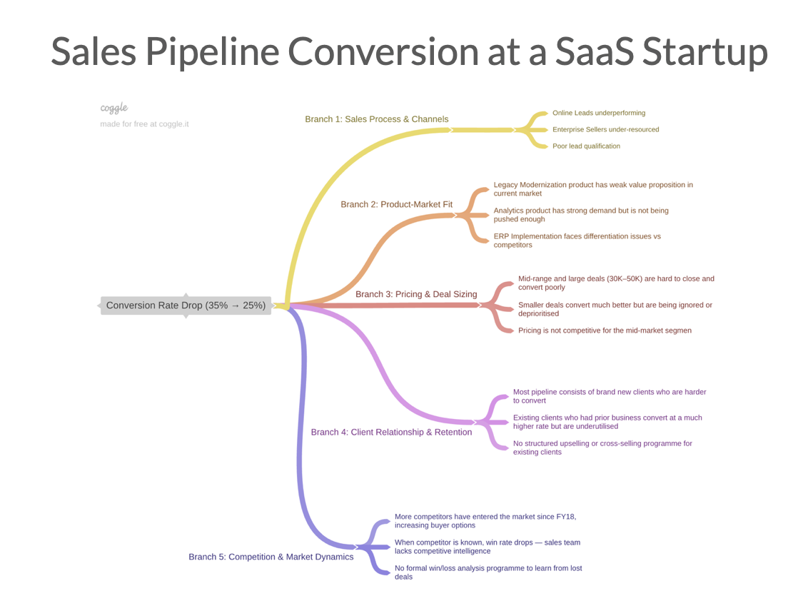
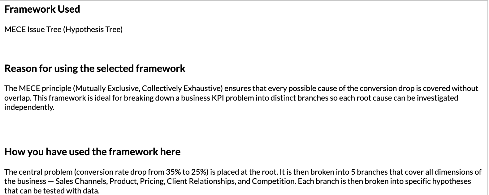
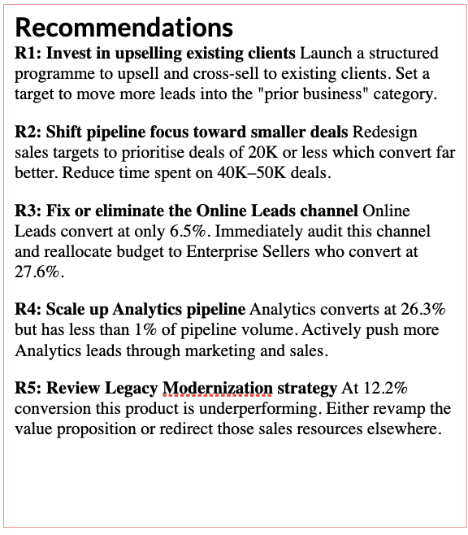
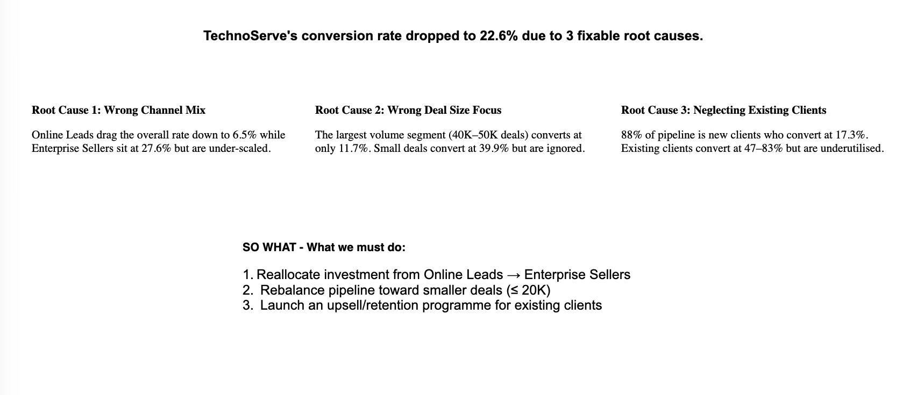

# 📊 TechnoServe Sales Pipeline Conversion Analysis
### A Business Analyst Case Study | Excel · PowerPoint · Frameworks

---

## 📌 Table of Contents
- [Project Overview](#project-overview)
- [Problem Statement](#problem-statement)
- [Part I — Understanding the Problem](#part-i--understanding-the-problem)
- [Part II — Hypothesis Formulation](#part-ii--hypothesis-formulation)
- [Part III — Data Analysis & Insights](#part-iii--data-analysis--insights)
- [Key Findings](#key-findings)
- [Final Recommendations](#final-recommendations)
- [Tools Used](#tools-used)
- [Files in This Repository](#files-in-this-repository)
- [What I Learned](#what-i-learned)

---

## 🔍 Project Overview

This project analyses the sales pipeline of **TechnoServe**, a B2B SaaS 
technology company, to identify why their lead conversion rate dropped 
significantly and recommend data-driven solutions to recover it.

| Detail | Value |
|---|---|
| Dataset Size | 78,025 sales opportunities |
| Current Conversion Rate | 22.6% |
| Target Conversion Rate | 35% |
| Gap to Close | 12.4 percentage points |
| Cities Covered | Mumbai, Delhi, Bengaluru, Chennai, Hyderabad, Kolkata, Pune |
| Technologies | ERP Implementation, Analytics, Technical Business Solutions, Legacy Modernization |

---

## ❗ Problem Statement

TechnoServe's sales pipeline conversion rate dropped from **35% at the end 
of FY 2017-18 to 22.6% currently** — a decline of 12+ percentage points. 
Only 1 in 4 qualified leads is being converted to a paying customer, 
compared to 1 in 3 previously.

The business needed to:
1. Understand WHY the conversion dropped
2. Identify which factors affect conversion the most
3. Recommend specific actions to recover the rate

---

## Part I — Understanding the Problem

### 5W Framework
The 5W framework was used to structure the problem clearly before 
jumping into analysis.

| Question | Answer |
|---|---|
| WHO | TechnoServe sales team, marketing team, and B2B clients across 7 Indian cities |
| WHAT | Conversion rate dropped from 35% to 22.6% after FY 2017-18 |
| WHEN | Decline began after end of FY 2017-18 and is ongoing |
| WHERE | Across all 7 cities and all sales channels |
| HOW | Visible in pipeline data — fewer opportunities reaching Won status |

---

### SPIN Selling Framework
Interview questions were framed under each SPIN category to understand 
the problem from the sales team's perspective.

**Situation** — What does the current pipeline look like?
**Problem** — Where are leads dropping off?
**Implication** — What is the revenue impact of the conversion drop?
**Need-Payoff** — What would improving conversion mean for the business?

---

## Part II — Hypothesis Formulation

### Framework Used: MECE Issue Tree
The MECE (Mutually Exclusive Collectively Exhaustive) Issue Tree was used 
to break the problem into 5 distinct branches covering all dimensions 
of the business without overlap.

### 5 Branches of the Issue Tree

| Branch | Key Hypotheses |
|---|---|
| Sales Process & Channels | Online Leads underperforming, Enterprise Sellers under-resourced |
| Product-Market Fit | Legacy Modernization has weak value proposition, Analytics underutilised |
| Pricing & Deal Sizing | Large deals convert poorly, small deals ignored |
| Client Relationship & Retention | New clients dominate pipeline despite low conversion |
| Competition & Market Dynamics | Lack of competitive intelligence hurting win rates |

**Total Hypotheses Formulated: 25+**
**Priority assigned from P0 (highest) to P4 (lowest)**

---

## Part III — Data Analysis & Insights

7 variables were analysed using Excel to identify patterns in conversion rate.

---

### 1. Technology Primary

| Technology | Conversion Rate |
|---|---|
| Analytics | 26.3% |
| ERP Implementation | 23.3% |
| Technical Business Solutions | 21.4% |
| Legacy Modernization | 12.2% |

**Pattern: Exception / Outlier**
Analytics converts best but has less than 1% of pipeline volume.
Legacy Modernization is a clear underperformer.

---

### 2. B2B Sales Medium

| Channel | Conversion Rate |
|---|---|
| Enterprise Sellers | 27.6% |
| Tele Sales | 21.9% |
| Marketing | 18.6% |
| Partners | 18.5% |
| Online Leads | 6.5% |

**Pattern: Magnitude / Outlier**
Online Leads convert 4x worse than Enterprise Sellers.
Channel mix is a major driver of the overall conversion drop.

---

### 3. Business from Client Last Year

| Prior Business | Conversion Rate |
|---|---|
| No prior business | 17.3% |
| 0 to 25,000 | 82.6% |
| 25,000 to 50,000 | 73.7% |
| 50,000 to 100,000 | 61.7% |
| More than 100,000 | 46.9% |

**Pattern: Strongest Trend in Dataset**
Prior clients convert at 47–83% vs 17.3% for new clients.
88% of pipeline is new clients — the worst converting segment.

---

### 4. Opportunity Sizing

| Deal Size | Conversion Rate |
|---|---|
| 10K or less | 39.9% |
| 10K to 20K | 26.7% |
| 20K to 30K | 24.7% |
| 30K to 40K | 17.4% |
| 40K to 50K | 11.7% |
| 50K to 60K | 17.3% |
| More than 60K | 21.0% |

**Pattern: Inverse Trend**
Smaller deals convert far better. The largest volume segment 
(40K–50K) has the worst conversion rate.

---

### 5. Client Revenue Sizing

**Pattern: No Significant Pattern**
Conversion rates range only from 19.3% to 22.9% across all 
client revenue categories. Client size is NOT a predictor of conversion.

---

### 6. City

| City | Conversion Rate |
|---|---|
| Mumbai | 25.4% |
| Delhi | 22.7% |
| Hyderabad | 21.9% |
| Chennai | 21.8% |
| Bengaluru | 21.7% |
| Kolkata | 21.3% |
| Pune | 18.9% |

**Pattern: Moderate Magnitude**
Mumbai leads, Pune trails. Geography matters but is a secondary factor.

---

### 7. Compete Intel

**Pattern: Outlier**
When a competitor is known, win rate drops to 19.5%.
Competitive intelligence is a meaningful differentiator.

---

## 💡 Key Findings

> **Finding 1:** Prior business relationship is the #1 predictor of 
> conversion. Existing clients convert 3–5x better than new ones yet 
> 88% of pipeline is new clients.

> **Finding 2:** Online Leads convert at only 6.5% — nearly 4x worse 
> than Enterprise Sellers at 27.6%. Channel mix is broken.

> **Finding 3:** The pipeline is dominated by 40K–50K deals that convert 
> at only 11.7% while small deals under 10K convert at 39.9% but are ignored.

---

## ✅ Final Recommendations

| # | Recommendation | Based On |
|---|---|---|
| R1 | Launch upselling programme for existing clients | Prior clients convert at 47–83% |
| R2 | Shift pipeline toward smaller deals under 20K | Inverse trend in opportunity sizing |
| R3 | Defund Online Leads, scale Enterprise Sellers | 4x conversion gap between channels |
| R4 | Aggressively grow Analytics pipeline | Highest conversion but lowest volume |
| R5 | Review Legacy Modernization strategy | Lowest conversion rate of all products |

**Target: Restore conversion rate from 22.6% back to 35%+**

---

## 🛠 Tools Used

- **Microsoft Excel** — COUNTIFS formulas, data analysis, bar charts
- **Microsoft PowerPoint** — Business storytelling, visualisation
- **Coggle** — MECE hypothesis tree diagram
- **Frameworks** — 5W, SPIN, MECE Issue Tree, Pyramid Principle

---

## 📁 Files in This Repository

| File | Description |
|---|---|
| TechnoServe_Analysis.xlsx | Excel file with 7 variable analysis sheets |
| TechnoServe_PPT.pptx | Full presentation covering Parts I, II and III |
| images/ | All screenshots used in this README |

---

## 📚 What I Learned

- How to structure an ambiguous business problem using frameworks
- How to formulate and prioritise hypotheses before looking at data
- How to use Excel COUNTIFS to analyse categorical data at scale
- How to identify patterns in data — trends, outliers, magnitude differences
- How to present findings to a CEO using the Pyramid Principle
- That the most important insight is not always the most obvious one

---

*This project was completed as part of a Business Analyst training programme 
covering Business Problem Solving, Insights and Storytelling.*
